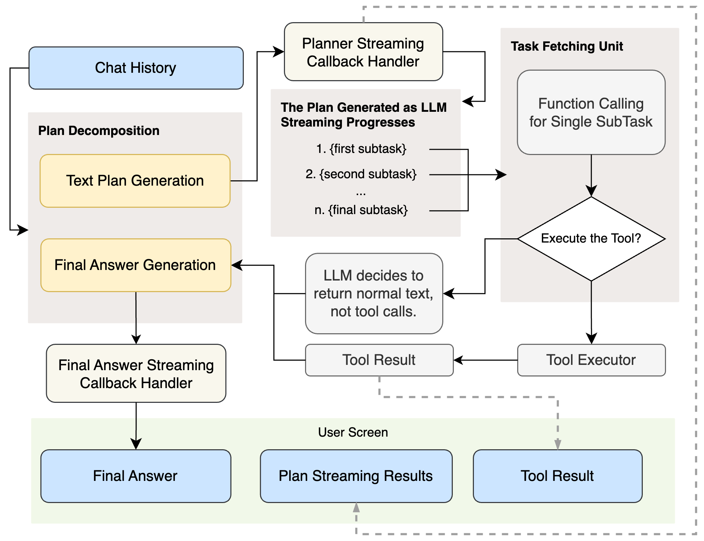
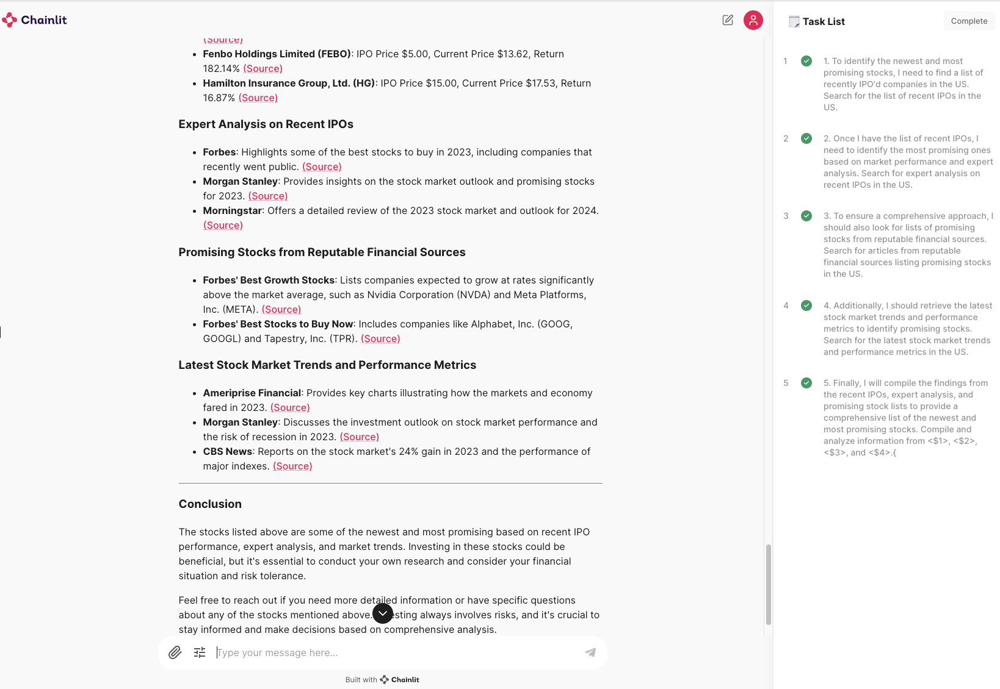

# LLMCompiler-Pro
_An extended project of the [LLM Compiler paper](https://arxiv.org/abs/2312.04511), focusing on developing LLM-based Autonomous Agents._

This project is an extension of the LLMCompiler research, developed with a focus on enhancing conversational capabilities, expanding the flexibility of plan decomposition, and broadening the concept of tools.
If you want to see the original LLMCompiler, please visit the [LLMCompiler repository](https://github.com/SqueezeAILab/LLMCompiler).

## Objective
- Enable integration with a wide range of APIs and tools beyond simple Python functions.
- Provide an interactive conversational interface. 
- Handle subtasks generated through plan decomposition with function calling.
- Maintain the fast processing speed of the original LLMCompiler.
- Ensure users do not experience waiting by offering various streaming interactions.
- Comprehensive refactoring and migration of deprecated modules from langchain and OpenAI.

## Architecture


## Dependencies Installation
- Prepare the python 3.12 using conda, pyenv, or any other method.
- Prepare the docker for docker-compose.

```shell
pip install poetry
poetry install --with dev --no-root
make up
```
## Run Demo
Before running the demo, prepare the ".env" file. "Promptlayer API Key" isn't necessary.
```shell
chainlit run main.py
````
[](https://www.youtube.com/watch?v=f7-Qee6QkEk)
Clik the Image to watch the demo video.

### Change the primary language of tool
If you want to change the primary language, you can change the language setting on the chainlit demo. 
This allows you to change the language, region, and search engine type for the Google search engine or the final answer.

## TODO
- [ ] Implement it to run using a local LLM (This will be a challenging task as it requires implementing function calling and JSON processing with the local LLM).

## Contribution Guidelines
Please make sure to use pre-commit hooks to ensure code quality and consistency.
```shell
pre-commit install -c .conf/.pre-commit.yaml
```
## Confirmed Issue
- There is an issue where the demo occasionally stops if the web browsing tool is used too extensively.
## Limitations
- Due to the dependency on Langchain for the streaming callback handler, the implementation of the Planner and Final Answer Generator, excluding the Task Fetching Unit, has become somewhat complex. It is necessary to reimplement these components without relying on Langchain.
- The OpenAPI 3.0 documents, commonly known as Swagger documents, cannot be immediately migrated to tools. A related converter needs to be developed.
- The speed of the Web Browsing Tool is somewhat slow, which affects the overall pipeline speed. Although this is a fundamental issue, I need to explore faster alternatives.
- There is an inconvenience in pre-injecting language settings for the configurations used by the tools and the Final Answer Generator. I need to develop a way to automatically generate and apply these language settings.

# Citations
```
@misc{kim2024llmcompilerparallelfunction,
      title={An LLM Compiler for Parallel Function Calling}, 
      author={Sehoon Kim and Suhong Moon and Ryan Tabrizi and Nicholas Lee and Michael W. Mahoney and Kurt Keutzer and Amir Gholami},
      year={2024},
      eprint={2312.04511},
      archivePrefix={arXiv},
      primaryClass={cs.CL},
      url={https://arxiv.org/abs/2312.04511}, 
}
```
